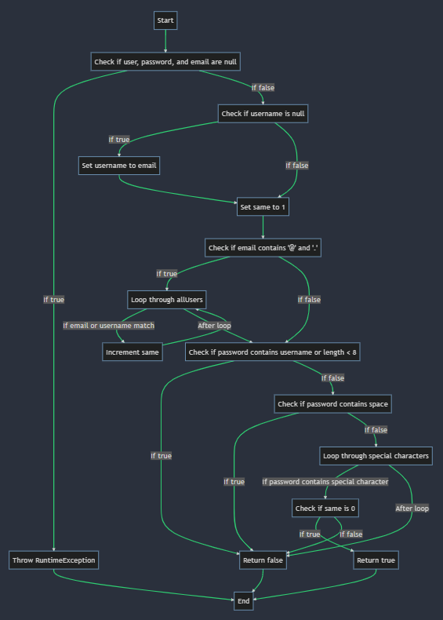

# Втора лабораториска вежба по Софтверско инженерство

## Марија Данилова, бр. на индекс 213109

### Control Flow Graph

### Тест случаи според критериумот Every branch

Цикломатската вредност е 11, по P+1, каде што P=10, а P е бројот на предикатни јазли, цикломатската комплексност изнесува 10+1=11.

### Тест случаи според критериумот Every branch

1 Проверува дали кодот фрли исклучок доколку се внесе корисник без корисничко име.

2 Проверува дали кодот фрли исклучок доколку се внесе корисник без лозинка.

3 Проверува дали кодот фрли исклучок доколку се внесе корисник без е-маил адреса

4 Проверува дали кодот коректно поставува корисничкото име со е-маил адресата доколку корисничкото име е null

### Тест случаи според критериумот Every path

1 Проверува дали кодот фрли исклучок доколку корисникот е null.

2 Проверува дали кодот фрли исклучок доколку се внесе корисник без лозинка и е-маил адреса.

3 Проверува дали кодот фрли исклучок доколку се внесе корисник без е-маил адреса.

4 Проверува дали кодот враќа true доколку сите услови се исполнети.
....
